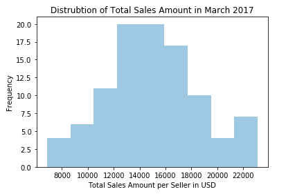
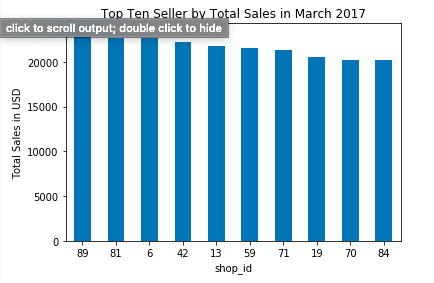
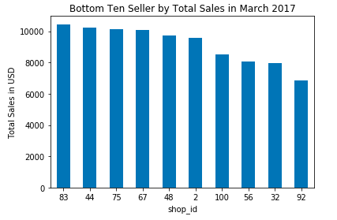

# Shopify Data Science Intern Challenge

### Question 1

A. I used pandas and python to write code to summarize the data, create histograms and box and whisker plots to look at the distributions for the order amounts and total items being ordered. The histograms and boxplots revealed two types of outliers. One outlier being a buyer with the user_id of 607 making purchases of 2000 shoes for a total order amount of $704,000 with a credit card 17 times at 4 am in the morning through the month of March 2017. Given that these transactions were only happening at 4am with a credit card and were such large transaction amount, I found them to be suspicious and did not include them in my new data set that I used for calulating my metric. The next outlier that I found was that seller with shop_id 78 was selling shoes for the price of $25,725 a pair; this is clearly not the going sale rate for shoes and decided to not include them in my final data set. All this work and code can be found in the EDA & Cleaning file in the repository. 

B. So for the question of "what metric would I use to report this data set?" is pretty tricky to me. I am wired like a data scientist and I think a lot about the context, what are we trying to solve? That being the case, I would still include the Average Order Value metric for the month of March to find out on average dollar amount of each transaction shoe sellers are doing. I would also include the average sales for the whole month of March done by shoe sellers, and also the total sales done by shoe seller in the month of March. I am also curious to see the top ten shoe sellers and bottom shoe sellers and study them more in depth as to why some shoe seller are succeeding more than others, maybe Shopify can then add a service that offers this advice to sellers so they can succeed in sales and continue doing business with Shopify. 

C. AOV = $302.58 \
Average Sales per Shoe Seller in the month of March = $15,089 \
Total Sales done by Shoe Sellers in the month of March = $1,493,840.00 \
Below are images of the distribution of sales per seller in the Month of March, as well as the top 10 sellers and bottom 10 sellers.\

### Question 2

A. How many orders were shipped by Speedy Express in total? \
Answer = 54 \
SQL QUERY --> SELECT COUNT(*) FROM Orders WHERE SHIPPERID = 1; 

B. What is the last name of the employee with the most orders? \
Answer = Peacock with 40 orders. \
SQL Query: \
SELECT Employees.LastName, COUNT(\*)  \
FROM Orders \
    INNER JOIN Employees \
    ON Orders.EmployeeID = Employees.EmployeeID \
    GROUP BY Employees.LastName \
    ORDER BY COUNT(*) DESC; 

C. What product was ordered the most by customers in Germany? \
Answer = Boston Crab Meat \
Ideal SQL CODE: 
SELECT Products.ProductName, Products.ProductID, SUM(Quantity) \
FROM OrderDetails \
INNER JOIN Products ON OrderDetails.ProductID = Products.ProductID \
INNER JOIN Orders ON Orders.OrderID = OrderDetails.OrderID \
INNER JOIN Customers ON Customers.CustomerID = Orders.CustomerID \
GROUP BY Products.ProductName, Products.ProductID \
ORDER BY SUM(Quantity) DESC \
WHERE Customers.Country = 'Germany'; 

Actual SQL Code: 

SELECT Customers.CustomerID, OrderID 
FROM Customers \
INNER JOIN Orders ON Customers.CustomerID = Orders.CustomerID \
WHERE Country = 'Germany'; 

SELECT ProductID, SUM(Quantity) \
FROM OrderDetails \
WHERE OrderID = 10391 OR OrderID = 10363 OR OrderID = 10337 OR OrderID = 10396 OR OrderID = 10267 OR OrderID = 10342 OR OrderID = 10323 OR OrderID = 10325 OR OrderID = 10284 OR OrderID = 10343 OR OrderID = 10279 OR OrderID = 10277 OR OrderID = 10407 OR OrderID = 10418 Or OrderID = 10273 OR OrderID = 10361 OR OrderID = 10285 OR OrderID = 10313 OR OrderID = 10286 OR OrderID = 10345 OR OrderID = 10438 OR OrderID = 10356 OR OrderID = 10301 OR OrderID = 10348 OR OrderID = 10312
GROUP BY ProductID \
ORDER BY SUM(Quantity) DESC; 

SELECT ProductName \
FROM Products \
WHERE ProductID = 40;

